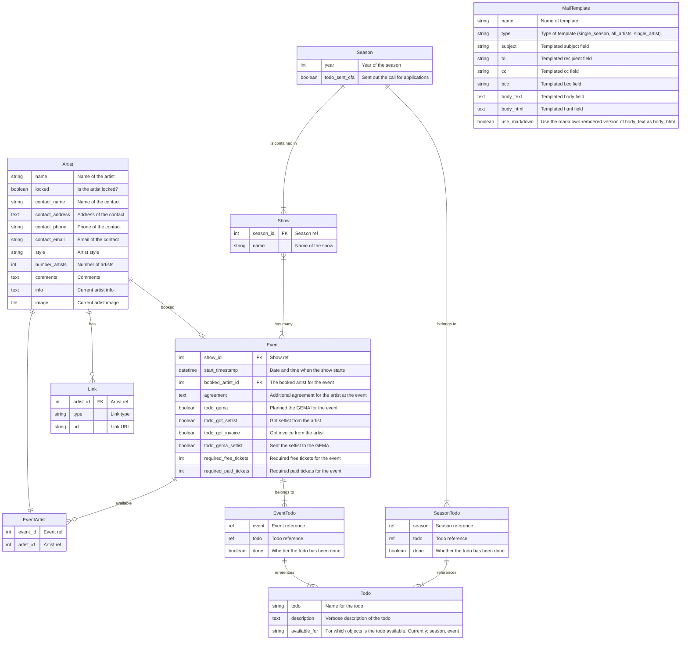

# Artistboard

Artistboard is a self hostable web app designed to help bookers manage their artist bookings for multiple events, categorized in shows and seasons.

It helps keeping track of all the required steps of a booking and includes mailing features on different data levels to e.g. sent out info mails to all artists in the roster or remind artists about missing infos.

Made with [Django](https://www.djangoproject.com/).

## Installation

### Using a container engine (e.g. Podman, Docker)

Refer to the configuration section on what environment variables to set. Additionally, set DJANGO_SUPERUSER_USERNAME, DJANGO_SUPERUSER_PASSWORD and DJANGO_SUPERUSER_EMAIL to create the superuser and start artistboard like this:

    podman run -e SECRET_KEY=veryverysecretstuff -e DJANGO_SUPERUSER_USERNAME=admin -e DJANGO_SUPERUSER_PASSWORD=secretpassword -e DJANGO_SUPERUSER_EMAIL=admin@company.com -p 8000:8000 ghcr.io/wabuehamm/artistboard:latest

Check out http://localhost:8000.

### Using native python

Artistboard requires a working Python 3, It is recommended to use the virtual environment features of python to properly install it. If you download a version of artistboard, install it like this:

    cd <artistboard-path>
	python -m venv .venv
	. ./.venv/bin/activate
	pip install -r requirements.txt

Set the required [configuration environment variables](#configuration) and then initialize the database:

	python manage.py migrate

Create a superuser to access artistboard:

    python manage.py createsuperuser

Finally, start Artistboard using Django's runserver:

    python manage.py runserver

For production-grade systems, refer to the [deployment chapter in Django's documentation](https://docs.djangoproject.com/en/5.2/howto/deployment/).

## Configuration

Artistboard is configured using this environment variables:

* DATABASE_URL: Database configuration for Django. See [the dj-database-url documentation](https://pypi.org/project/dj-database-url/) for details
* SECRET_KEY: The Django secret key
* APPLICATION_HOST: Host the application runs on (e.g. skills.company.com). Required if DEBUG is not set to true.
* DEBUG: Whether to run the application in Django debug mode [False]
* EMAIL_HOST: SMTP host to send mails
* EMAIL_PORT: SMTP port [25]
* EMAIL_HOST_USER: User to send mails
* EMAIL_HOST_PASSWORD: Password of the smtp user
* EMAIL_USE_TLS: Use TLS [false]

If you use the container solution, these variables are used to automatically create the superuser:

* DJANGO_SUPERUSER_USERNAME: Username of superuser
* DJANGO_SUPERUSER_PASSWORD: Password of superuser
* DJANGO_SUPERUSER_EMAIL: Email address of superuser

## Usage

See the [user documentation](./docs/README.md) for details on how to use artistboard.

## Development

artistboard is written in Python and made using [Django](https://www.djangoproject.com/) with the help of [iommi](https://iommi.rocks/) and other tools.

We're happy to get bug reports or feature requests on our [Github repository](https://github.com/wabuehamm/artistboard/issues) or to [receive pull requests for fixes or new features](https://github.com/wabuehamm/artistboard/pulls).

### Data design

