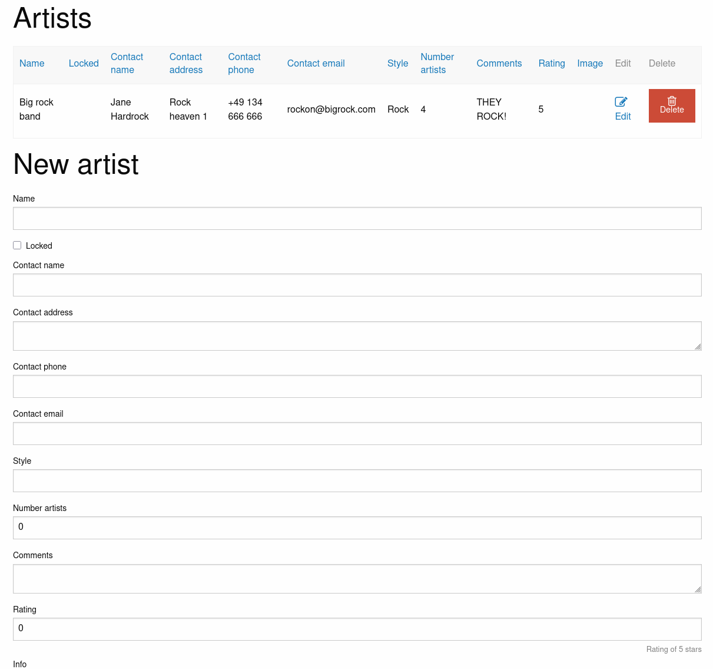
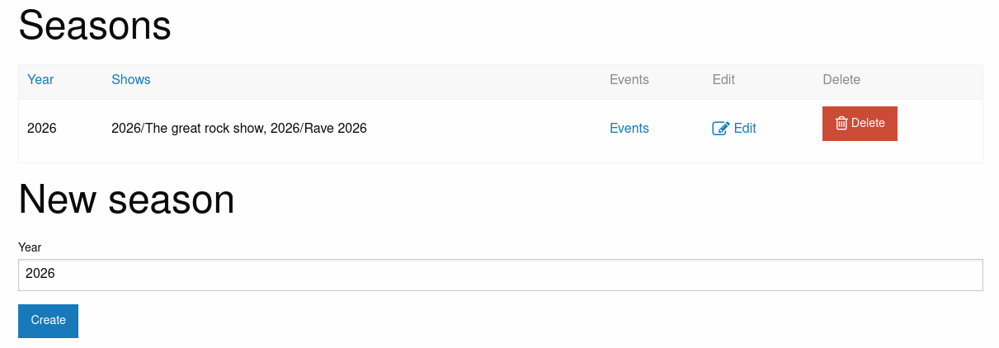
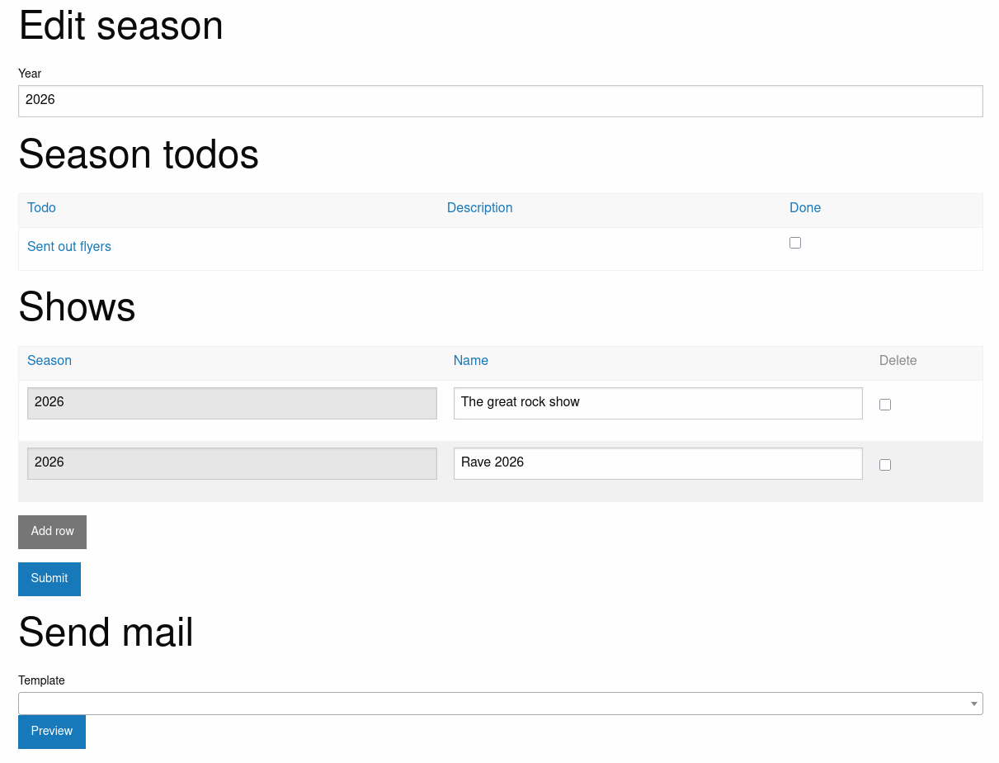
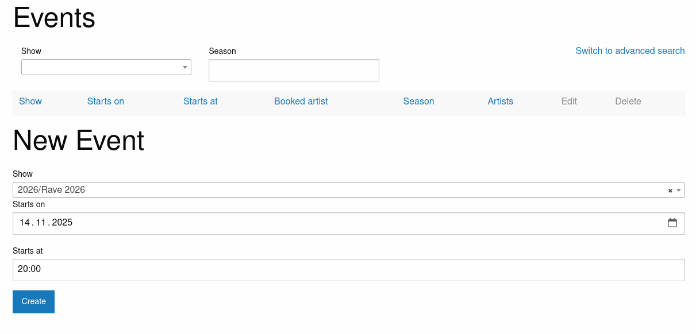
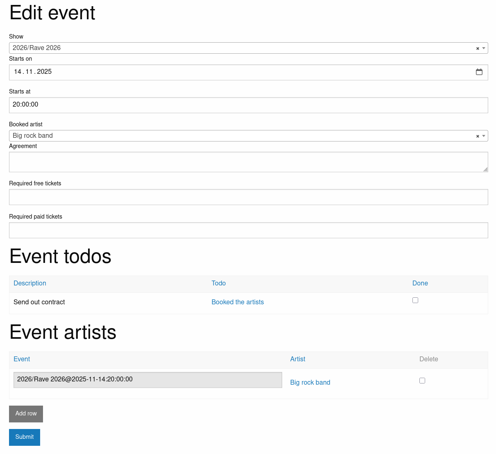
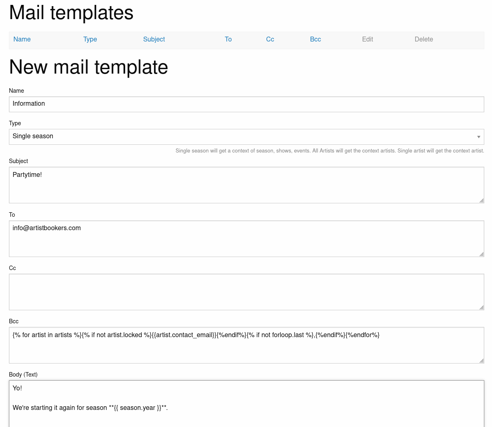
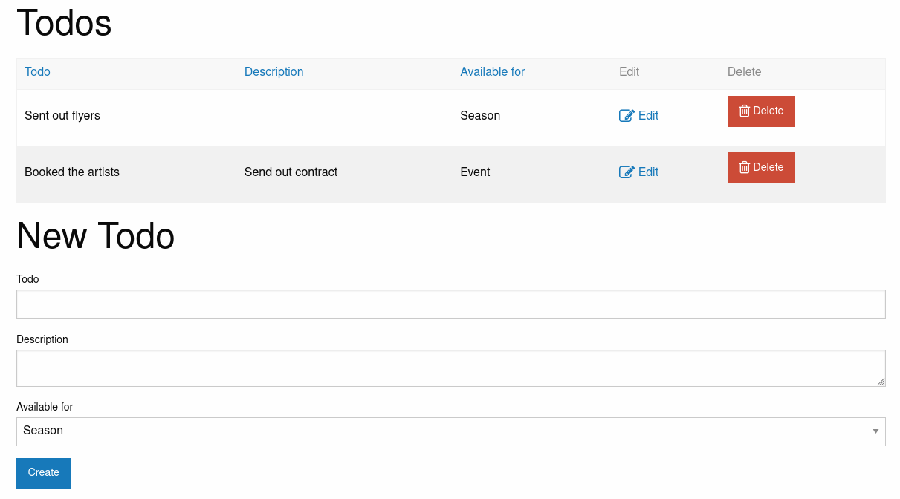

# Artistboard user documentation

## Getting started

### Creating new users

After the superuser was created, it is recommended that you create another user without superuser rights. To do this, go to your artistboard's /admin URL and log in as the superuser. Click on the plus next to the users and add a user with their username, email and password.

Logout and re-login with the normal user account.

## Managing artists

The cornerstone of booking management are the artists. With artistboard you can enter all the required data for your artists. Click on "artists" to see the artist overview:

Use the lower form to add a new artist to the database.

If you click on "Edit" you can change the data of artists already inserted in the database. Additionally, you can add links to social media, spotify, soundcloud etc.

Also, you can send out mails to the selected artist. More on that in the mailing section.

## Managing events

In artistboard, events are categorized in shows and shows in turn are organized in seasons. To start managing events, click on season to see the season overview:

Click on Edit to edit the season and add shows:

For every event you can add artists that are available for that event. When you have decided on which artist to book, you can select the artist from a list of available artists for that event.

Additionally, you can check the todos here to organize yourself. More on that in the todo section.

Also, you can send out a mail based on the currently selected season. More on that in the mailing section.

Click on "Events" to see the list of events for that season.

Create new events for the selected show of the season on specific dates and times. Click on "Edit" to edit the event.

Additionally, you can check the todos here for the event to organize yourself. More on that in the todo section.

## Mailings

artistboard supports sending out templated e-mails filled with relevant data. Click on "Mail templates" to see a list of templates and add a new one.

A template is designed for different points in artistboard. Depending on that type, the template will get different contexts with data that you can use.

* Single season will get a context of season, shows, events and artists
* All Artists will get the context of all artists
* Single artist will get the context of artist, all booked events for that artists and all events without a booked artist

Please refer to the [models definition](../artistboard/models.py) for the available fields of the different context parts.

For each template you can specify the typical recipient fields, the subject and the body in text and HTML form. Additionally, you can enable markdown support to use markdown to render the text body and use it as the HTML body. See the [Markdown guide](https://www.markdownguide.org/) for more information on how to write in Markdown.

Every field is a template field and will be rendered using Django's template system before sending out the mail. This requires a bit of knowledge about this system. See the [documentation about designing templates](https://docs.djangoproject.com/en/5.2/ref/templates/language/) for more details.

Before you can start sending out mails, be sure to configure the email settings in artistboard correctly. See the main [README](../README.md) about this.

On the respective page (e.g. the Season or the artists), select a matching template and click "Preview" to see what data will be send out. If everything is fine, click on "Send" to send out the mail.

## Todos

artistboard supports attaching customized to do items to seasons and events. These can be used to organize yourself and make sure, you have done everything required and didn't miss anything.

Click on "Todos" to see the todo overview:

Use the form to add a new todo item. Todos can be made available for seasons and events. If you click on "Edit" you can edit the todo and see an overview of all events that are connected to the todo.

The filter feature currently is deactivated here because of [this Github issue](https://github.com/iommirocks/iommi/issues/686).

**Hint**: artistboard automatically adds all the required todo items to a season or an event when it is created. If you add new todos configurations after you have created a season or an event, you'll have to edit the season or event and click on "Save" to trigger todo item generation again.